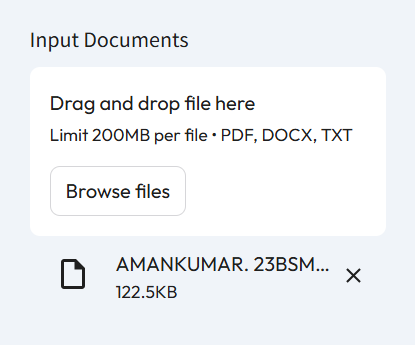
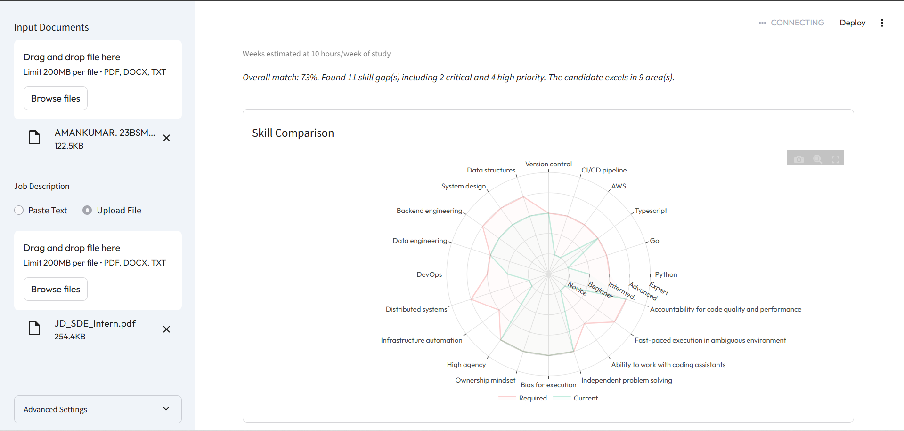
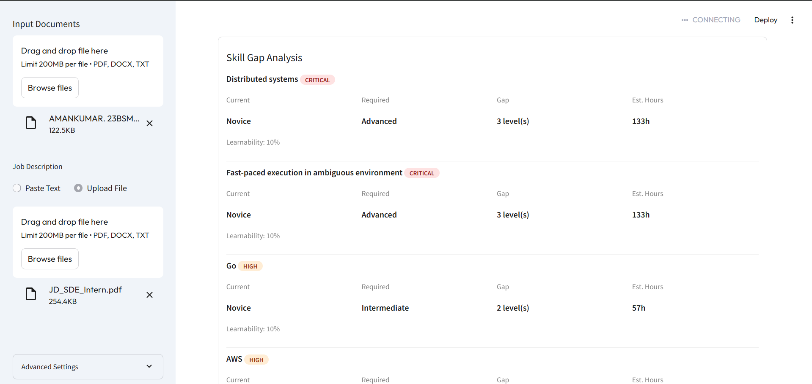
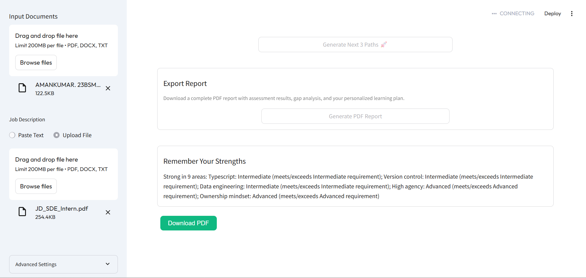

# AI-Powered Skill Assessment & Personalized Learning Plan Agent

An AI agent that takes a **Job Description** and a **candidate's resume**, conversationally assesses real proficiency on each required skill, identifies gaps, and generates a **personalized learning plan** with curated resources and time estimates.

# Visit : [(https://skillscopeai.streamlit.app/](https://skillscopeai.streamlit.app/)

## Features & UI Showcase

_Note: Replace the placeholder links below with the actual paths to your screenshots._

**1. Document Upload & Parsing**
_Upload a candidate's resume and a target Job Description to instantly extract and map required vs. claimed skills._


**2. Visual Skill Comparison**
_An interactive radar chart plotting the JD's required proficiency levels against the candidate's current capabilities._


**3. Adaptive Conversational Assessment**
_The Assessor Agent conducts a real-time technical interview, dynamically adjusting question difficulty based on the candidate's answers._

**4. Prioritized Skill Gap Analysis**
_Clear identification of Critical, High, Medium, and Low priority gaps, factoring in "Learnability" based on adjacent skills._


**5. Personalized Learning Plan & PDF Export**
_A tailored roadmap with actionable milestones, curated resources, and a downloadable PDF report._


---

## System Architecture

Based on the codebase, the agent is designed as a multi-agent system orchestrated through a Streamlit UI.


### Component Breakdown

- **UI/Orchestrator (`streamlit_app.py`):** Manages the user state, handles document uploads, and provides the chat interface for the conversational assessment.
- **Parser Agent (`app/agents/parser_agent.py`):** Uses a high-context LLM to extract a structured list of skills from the Job Description (with required levels: e.g., Required/Preferred) and the Resume (with claimed levels: e.g., Beginner/Expert).
- **Assessor Agent (`app/agents/assessor_agent.py`):** Generates a targeted question bank for the mismatched skills. It manages the real-time chat, evaluates the candidate's answers, and dynamically adjusts the difficulty of the next question.
- **Gap Analyzer (`app/agents/gap_analyzer.py`):** Compares the _assessed_ level against the _required_ level. It cross-references the candidate's existing skills against a taxonomy (`app/data/skill_taxonomy.json`) to find "adjacent skills" (e.g., knowing React makes learning Vue easier).
- **Plan Generator (`app/agents/plan_generator.py`):** Uses an LLM to generate a customized strategy and milestone path for each gap, injecting real, curated learning resources (courses, docs) from a local JSON database (`app/data/resources_db.json`).

---

## Scoring & Logic Description

**1. The 5-Level Proficiency Rubric**
The entire system operates on a standardized, 5-level numeric scale to ensure objective comparisons between the Job Description, the Resume, and the Assessment:

- **Level 1 (Novice):** Cannot explain core concepts; no hands-on experience.
- **Level 2 (Beginner):** Understands basics; has done tutorials or small projects.
- **Level 3 (Intermediate):** Can build real projects; debugs common issues independently.
- **Level 4 (Advanced):** Can architect solutions; understands under-the-hood mechanics.
- **Level 5 (Expert):** Industry-level expertise; can design novel systems from scratch.

**2. Adaptive Assessment Logic**
The system does not give every candidate the same test. It adapts based on real-time performance:

- **Starting Point:** The agent starts the interview **one level below** the candidate's claimed proficiency on their resume (to provide a warm-up and avoid immediate failure).
- **Dynamic Adjustment:** Each answer is scored 1 to 5 by the LLM.
  - If `score >= 4` (Strong): The next question jumps up a difficulty level.
  - If `score == 3` (Adequate): The difficulty remains the same to verify consistency.
  - If `score <= 2` (Poor): The difficulty drops down a level.
- **Final Assessment:** The candidate's final assessed level is the highest difficulty tier where they achieved a passing score (>= 3).

**3. Gap Sizing & Priority Routing**
Skill gaps are calculated using the formula: `Gap Size = Required Level - Assessed Level`. Priority is then determined by combining the Gap Size with the JD's requirement type:

- **Critical:** Gap of 3+ levels on a "Required" skill.
- **High:** Gap of 2 levels on a "Required" skill, or 3+ on a "Preferred" skill.
- **Medium/Low:** Minor gaps (1 level) or gaps in "Nice-to-have" skills.

**4. Learnability & Time Estimation**
Learning paths are not generic; they account for the candidate's existing knowledge.

- **Baseline Time:** The system applies a baseline hour estimate to jump from one level to the next (e.g., Beginner to Intermediate = 40 hours).
- **Adjacency Discount:** The Gap Analyzer cross-references the candidate's existing skills using a graph-like taxonomy. If the candidate needs to learn _Next.js_, and the system sees they already know _React_ and _TypeScript_, it calculates a high **Learnability Score**. This score discounts the estimated learning time by up to 50%, generating a realistic, accelerated learning path rather than a beginner's tutorial.

---

## How This Submission Meets the Judging Criteria

- **Does it actually work end-to-end?:** Fully functional prototype successfully taking a user from document upload to AI-driven chat assessment, resulting in a generated learning plan and downloadable PDF.
- **Quality of the core agent:** Utilizes a sophisticated multi-agent architecture (Parser, Assessor, Analyzer, Planner) with adaptive conversational logic and robust retry/fallback mechanisms across LLMs.
- **Quality of the output it produces:** Generates highly specific, actionable output including interactive radar charts, granular skill gap priorities, and a professional, downloadable PDF summarizing the roadmap.
- **Technical implementation:** Built using modern frameworks (`Streamlit`, `LangChain`) with advanced LLM routing, intelligent JSON parsing/repair functions, and caching to optimize speed and API usage.
- **Innovation & creativity:** The "Learnability Score" concept is a creative differentiator—it treats learning as a graph, recognizing that candidates learn faster if they have "adjacent" skills, resulting in personalized time estimates.
- **UX — is it usable?:** Features a clean, modern aesthetic with a clear stepper flow (Upload Docs -> AI Parsing -> Assessment -> Results) ensuring a frictionless user journey.
- **Clean, documented code:** Highly modular directory structure with isolated agent logic, comprehensive docstrings, and strict Pydantic schemas ensuring data reliability between components.

---

## Quick Start

### Prerequisites

- Python 3.13+
- Groq API Key (free at [console.groq.com](https://console.groq.com))
- OpenRouter API Key

### Setup

```bash
# Clone the repo
git clone https://github.com/AMAN081118/skill-assessment-agent-deccanAI.git
cd skill-assessment-agent

# Create virtual environment
python -m venv venv
source venv/bin/activate  # or venv\Scripts\activate on Windows

# Install dependencies
pip install -r requirements.txt

# Set up environment variables
cp .env.example .env
# Edit .env and add your API keys

# Run the app
streamlit run app/streamlit_app.py
```
